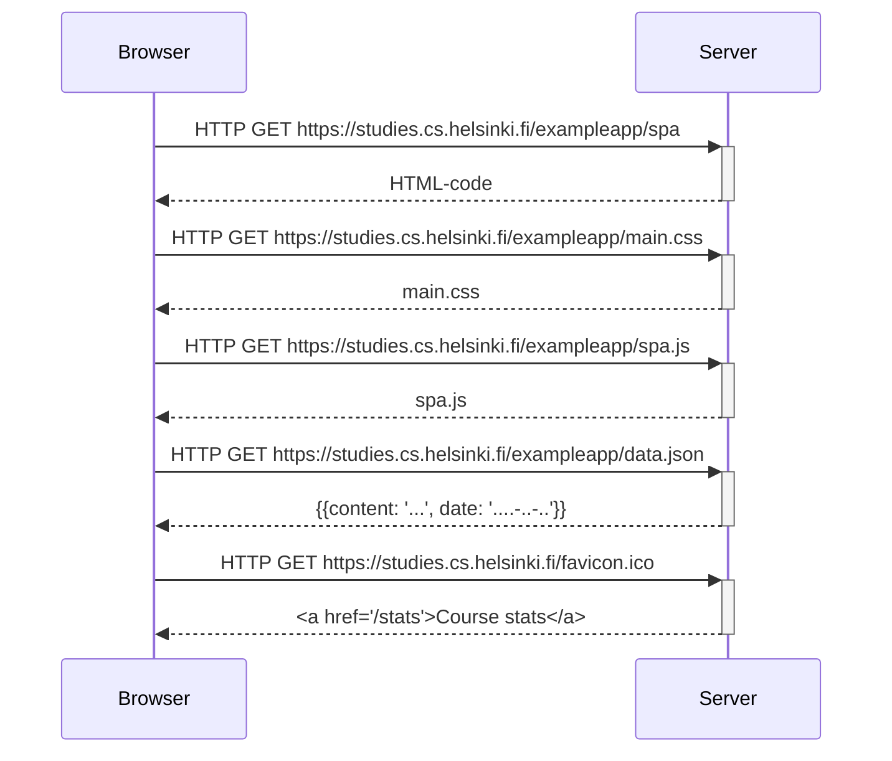

```mermaid
sequenceDiagram;
    Browser->>+Server: HTTP GET https://studies.cs.helsinki.fi/exampleapp/spa;
    Server-->>-Browser: HTML-code;
    Browser->>+Server: HTTP GET https://studies.cs.helsinki.fi/exampleapp/main.css;
    Server-->>-Browser: main.css;
    Browser->>+Server: HTTP GET https://studies.cs.helsinki.fi/exampleapp/spa.js;
    Server-->>-Browser: spa.js;
    Browser->>+Server: HTTP GET https://studies.cs.helsinki.fi/exampleapp/data.json;
    Server-->>-Browser: {{content: '...', date: '....-..-..'}};
    Browser->>+Server: HTTP GET https://studies.cs.helsinki.fi/favicon.ico;
    Server-->>-Browser: <a href="/stats">Course stats</a>;
```
